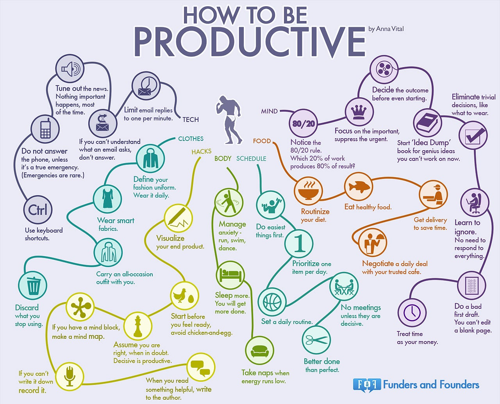

# Productivity tips to remember while working

## 32 Principles of Productivity Works

### Mindset

1. 80% of results come from 20% of your work - Pareto Law
2. if being productive means being selfish, be selfish
3. it's not about time, It's about energy
4. keep starting untill you really start
5. leverage being lazy into finding the easier way
6. Do what gives the fastest result first
7. Say no fast when you mean it
8. Finish fast, often imperfect

### Habit

1. Singletask
2. structure procrastination
3. Do it everyday, on holidays, no exceptions
4. it takes 21 days to form a habit
5. Being regular beats being good
6. Will power is limited, notice when it runs out
7. agree to new plans only if both mind and heart say yes
8. Ignore people who don't offer anything for your time

### Hacks

1. Visualize your train of thought - or it does not exist
2. Read visual information, avoid text
3. Any idea can be simplified into diagram
4. In the morning, draw a mindmap of the day ahead
5. Fake ineptitude when needed
6. If you can do it in 2 minutes, do it now
7. Write emails under 5 lines
8. Turn of all electronics

### Body

1. Relax as much as you work
2. Color -code your tasks
3. Shower when you want to think
4. Use paper when computer is not necessary
5. Solve problems in your sleep
6. Have your nemesis - competition motivates
7. Set physical consequencces (20 pull-ups)
8. positive words attract a positive outcome

### Mind map of hacks

